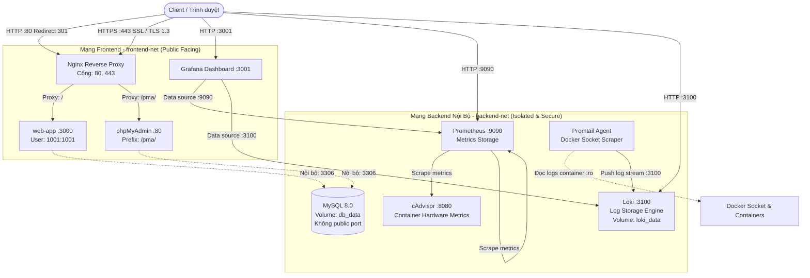

# Đề Tài 35: Triển Khai Hệ Thống Multi-tier Docker, Nginx Reverse Proxy, Monitoring & Centralized Logging

**Sinh viên thực hiện**: Mã SV: `dtc235210064`  
**Học phần**: Hệ Thống & Bảo Mật / Quản Trị Hệ Thống - DevSecOps  
**Phiên bản**: Commit 3 (Hoàn thành đầy đủ 6/6 Tiêu chí)

---

## 1. Tổng Quan Dự Án

Dự án triển khai một hệ thống dịch vụ hoàn chỉnh trên nền tảng **Docker & Docker Compose** theo mô hình kiến trúc đa tầng (Multi-tier Architecture), đáp ứng nghiêm ngặt các tiêu chuẩn về **Network Isolation**, **Container Hardening**, **Monitoring (Giám sát metrics)** và **Centralized Logging (Quản lý log tập trung)**:

- **Tiêu chí 1 & 2**: Xây dựng ứng dụng web Node.js câu hỏi trắc nghiệm an toàn thông tin, tích hợp cơ sở dữ liệu MySQL 8.0 và công cụ quản trị phpMyAdmin.
- **Tiêu chí 3**: Thiết lập Nginx Reverse Proxy với HTTPS SSL (tự ký), tự động chuyển hướng HTTP (80) sang HTTPS (443) và áp dụng các Security Headers chống tấn công (Clickjacking, MIME Sniffing, XSS).
- **Tiêu chí 4**: Tích hợp hệ thống giám sát hiệu năng với Prometheus, cAdvisor và Grafana trực quan hóa thông số phần cứng container.
- **Tiêu chí 5**: Triển khai hệ thống thu thập và lưu trữ log tập trung (Centralized Logging) sử dụng Loki và Promtail.
- **Tiêu chí 6**: Áp dụng Container Hardening toàn diện: chạy non-root user (UID `1001:1001`), giới hạn tài nguyên CPU/RAM (`deploy.resources.limits`) cho tất cả các dịch vụ, gắn kết volume cấu hình ở chế độ chỉ đọc (`:ro`), và cách ly mạng 2 tầng (`frontend-net` & `backend-net`).

---

## 2. Kiến Trúc Mạng & Dịch Vụ (Architecture & Topology)

Hệ thống được thiết kế phân tầng rõ ràng, đảm bảo nguyên tắc đặc quyền tối thiểu (Least Privilege) và cô lập mạng:



### Danh Mục Các Dịch Vụ (9 Services):

| STT | Dịch Vụ | Container Name | Image | Cổng Mở Host | Cổng Nội Bộ | Mạng | Chức Năng |
| :--- | :--- | :--- | :--- | :--- | :--- | :--- | :--- |
| 1 | **Nginx** | `nginx` | `nginx:alpine` | `80`, `443` | `80`, `443` | `frontend-net` | Reverse Proxy, SSL Termination, Security Headers |
| 2 | **Web App** | `web-app` | Tự build từ `Dockerfile` | Không mở | `3000` | `frontend-net`, `backend-net` | Node.js Web Server (Non-root user UID `1001`) |
| 3 | **MySQL** | `db` | `mysql:8.0` | Không mở | `3306` | `backend-net` | Cơ sở dữ liệu quan hệ, lưu trữ bền vững với `db_data` |
| 4 | **phpMyAdmin**| `phpmyadmin` | `phpmyadmin:latest` | Không mở | `80` | `frontend-net`, `backend-net` | Quản trị MySQL qua Web tại URL `/pma/` |
| 5 | **Prometheus**| `prometheus` | `prom/prometheus:latest`| `9090` | `9090` | `backend-net` | TSDB thu thập và lưu trữ metrics hiệu năng |
| 6 | **cAdvisor** | `cadvisor` | `gcr.io/cadvisor/cadvisor:latest` | Không mở | `8080` | `backend-net` | Thu thập metrics CPU, RAM, Disk I/O container |
| 7 | **Grafana** | `grafana` | `grafana/grafana:latest`| `3001` | `3000` | `frontend-net`, `backend-net` | Giao diện Dashboard trực quan hóa Metrics & Logs |
| 8 | **Loki** | `loki` | `grafana/loki:latest` | `3100` | `3100` | `backend-net` | Hệ thống lưu trữ và đánh chỉ mục Log tập trung |
| 9 | **Promtail** | `promtail` | `grafana/promtail:latest` | Không mở | `9080` | `backend-net` | Agent thu thập logs từ Docker engine gửi về Loki |

---

## 3. Danh Sách Cổng & Đường Dẫn Truy Cập Hệ Thống

| Dịch Vụ / Tính Năng | Giao Thức & URL | Cổng Host | Tài Khoản / Ghi Chú |
| :--- | :--- | :--- | :--- |
| **Web App (Chính thức)** | [https://localhost/](https://localhost/) | `443` (HTTPS) | Truy cập trực tiếp qua Nginx Reverse Proxy bảo mật |
| **Web App (HTTP chuyển hướng)**| [http://localhost/](http://localhost/) | `80` (HTTP) | Tự động chuyển hướng `301 Moved Permanently` sang HTTPS |
| **Quản trị cơ sở dữ liệu** | [https://localhost/pma/](https://localhost/pma/) | `443` (HTTPS) | **phpMyAdmin** (Định tuyến an toàn qua Nginx) |
| - *Tài khoản Root MySQL* | | | `root` / `RootSecurePass_2026!#` |
| - *Tài khoản App MySQL* | | | `app_user` / `SecureAppPass_2026!#` |
| **Grafana Dashboard** | [http://localhost:3001/](http://localhost:3001/) | `3001` | Mặc định: `admin` / `admin` (Xem biểu đồ & logs) |
| **Prometheus UI** | [http://localhost:9090/](http://localhost:9090/) | `9090` | Kiểm tra trạng thái Scrape Targets tại `/targets` |
| **Loki API / Readiness** | [http://localhost:3100/ready](http://localhost:3100/ready) | `3100` | Trả về `ready` khi Loki sẵn sàng tiếp nhận log |

---

## 4. Chi Tiết Triển Khai Tiêu Chí Kỹ Thuật

### Tiêu Chí 5: Centralized Logging với Loki & Promtail
- **Loki Server**: Cấu hình tại [loki/local-config.yaml](file:///d:/%C4%90%E1%BB%81%20t%C3%A0i%2035/loki/local-config.yaml). Hoạt động ở chế độ Single-Binary tối ưu, sử dụng TSDB index và filesystem lưu trữ chunks tại volume bền vững `loki_data:/loki`.
- **Promtail Agent**: Cấu hình tại [promtail/config.yml](file:///d:/%C4%90%E1%BB%81%20t%C3%A0i%2035/promtail/config.yml). Kết nối trực tiếp với Docker Daemon qua `/var/run/docker.sock` ở chế độ read-only, sử dụng `docker_sd_configs` tự động phát hiện mọi container Docker, bóc tách tên container (`__meta_docker_container_name`) và luồng (`stream`) rồi gửi về endpoint `http://loki:3100/loki/api/v1/push`.
- **Truy vấn logs trên Grafana**:
  1. Đăng nhập Grafana tại `http://localhost:3001`.
  2. Vào **Connections** > **Data Sources** > Thêm **Loki**.
  3. Điền URL: `http://loki:3100` và nhấn **Save & Test**.
  4. Mở tab **Explore**, chọn Data Source **Loki** và nhập truy vấn LogQL:
     - Xem log web: `{container="web-app"}`
     - Xem log Nginx: `{container="nginx"}`
     - Xem toàn bộ hệ thống: `{container=~".+"}`

### Tiêu Chí 6: Hardening & Bảo Mật Toàn Diện (System Hardening)
1. **Network Isolation (Cách ly mạng phân tầng)**:
   - Mạng `frontend-net`: Chỉ gồm các dịch vụ cần tiếp nhận request hoặc tương tác từ người dùng (`nginx`, `web-app`, `phpmyadmin`, `grafana`).
   - Mạng `backend-net`: Mạng riêng biệt nội bộ. Dịch vụ cơ sở dữ liệu `db` (MySQL) **hoàn toàn không mở cổng ra ngoài host** (`no public ports`), ngăn chặn tuyệt đối các đòn tấn công brute-force hoặc xâm nhập trực tiếp từ Internet.
2. **Non-Root User**:
   - Container `web-app` được xây dựng trong [Dockerfile](file:///d:/%C4%90%E1%BB%81%20t%C3%A0i%2035/Dockerfile) với user `appuser` (UID: `1001`, GID: `1001`).
   - Khai báo rõ ràng trong [docker-compose.yml](file:///d:/%C4%90%E1%BB%81%20t%C3%A0i%2035/docker-compose.yml) với chỉ thị `user: "1001:1001"`. Dù kẻ tấn công có chiếm được shell của ứng dụng cũng không có quyền root trên container hoặc host.
3. **Giới Hạn Tài Nguyên (Resource Limits)**:
   - Mọi service quan trọng đều được đặt ngưỡng trần CPU và RAM thông qua `deploy.resources.limits` để ngăn ngừa tấn công DoS / cạn kiệt tài nguyên (Memory Leak, CPU Starvation):
     - `db`: CPU `1.00`, RAM `1024M`
     - `web-app`: CPU `0.50`, RAM `512M`
     - `nginx`: CPU `0.50`, RAM `256M`
     - `phpmyadmin`: CPU `0.50`, RAM `256M`
     - `prometheus`: CPU `0.50`, RAM `512M`
     - `grafana`: CPU `0.50`, RAM `512M`
     - `loki`: CPU `0.50`, RAM `512M`
     - `cadvisor`: CPU `0.30`, RAM `256M`
     - `promtail`: CPU `0.30`, RAM `256M`
4. **Read-Only Volume Mounts (`:ro`)**:
   - Các tệp cấu hình cốt lõi và socket nhạy cảm được mount với cờ `:ro` (chỉ đọc), ngăn chặn tiến trình trong container chỉnh sửa hoặc chèn mã độc:
     - `./nginx/nginx.conf:/etc/nginx/nginx.conf:ro`
     - `./nginx/ssl:/etc/nginx/ssl:ro`
     - `./prometheus/prometheus.yml:/etc/prometheus/prometheus.yml:ro`
     - `./loki/local-config.yaml:/etc/loki/local-config.yaml:ro`
     - `./promtail/config.yml:/etc/promtail/config.yml:ro`
     - `/var/run/docker.sock:/var/run/docker.sock:ro`
5. **HTTPS & Security Headers (Nginx)**:
   - Cấu hình tại [nginx/nginx.conf](file:///d:/%C4%90%E1%BB%81%20t%C3%A0i%2035/nginx/nginx.conf):
     - Giao thức an toàn: `TLSv1.2 TLSv1.3`.
     - `X-Frame-Options: SAMEORIGIN` (Chống Clickjacking).
     - `X-Content-Type-Options: nosniff` (Chống MIME Sniffing).
     - `X-XSS-Protection: 1; mode=block` (Chống XSS).
     - `Referrer-Policy: strict-origin-when-cross-origin`.

---

## 5. Hướng Dẫn Vận Hành & Triển Khai Hệ Thống

### 5.1. Khởi động toàn bộ hệ thống (Chỉ với 1 lệnh duy nhất)

Mở terminal tại thư mục gốc của dự án và chạy:

```bash
docker compose up -d
```

> **Lưu ý**: Lệnh trên sẽ tự động:
> 1. Build image cho `web-app` từ `Dockerfile`.
> 2. Kéo (pull) các image chính thức từ Docker Hub (`nginx`, `mysql:8.0`, `phpmyadmin`, `prometheus`, `cadvisor`, `grafana`, `loki`, `promtail`).
> 3. Tự tạo 2 mạng `frontend-net` và `backend-net`.
> 4. Khởi tạo 3 volumes bền vững (`db_data`, `grafana_data`, `loki_data`).
> 5. Khởi chạy 9 container theo đúng trình tự phụ thuộc (`depends_on`).

### 5.2. Kiểm tra trạng thái các container

```bash
docker compose ps
```

*Tất cả 9 dịch vụ (`nginx`, `web-app`, `db`, `phpmyadmin`, `prometheus`, `cadvisor`, `grafana`, `loki`, `promtail`) phải ở trạng thái `Up` hoặc `running`.*

### 5.3. Xem logs hệ thống

- Theo dõi logs toàn bộ hệ thống theo thời gian thực:
  ```bash
  docker compose logs -f
  ```
- Theo dõi logs của từng dịch vụ cụ thể:
  ```bash
  docker compose logs -f loki
  docker compose logs -f promtail
  docker compose logs -f web-app
  docker compose logs -f nginx
  ```

### 5.4. Dừng và hạ hệ thống

- Tạm dừng các container (dữ liệu vẫn được bảo toàn):
  ```bash
  docker compose stop
  ```
- Dừng và gỡ bỏ container, giữ nguyên volumes dữ liệu:
  ```bash
  docker compose down
  ```
- Gỡ bỏ toàn bộ bao gồm cả volumes dữ liệu:
  ```bash
  docker compose down -v
  ```

---

## 6. Cấu Trúc Thư Mục Dự Án

```
d:\Đề tài 35\
├── .dockerignore
├── Dockerfile                   # Dockerfile build Web App (Node.js Alpine, non-root user UID 1001)
├── docker-compose.yml           # Khai báo toàn bộ 9 dịch vụ, volumes, networks, resource limits
├── index.html                   # Giao diện ứng dụng trắc nghiệm kiến thức an toàn thông tin
├── style.css                    # Bảng định kiểu giao diện hiện đại, responsive
├── script.js                    # Logic câu hỏi trắc nghiệm, tính điểm, kết nối API
├── server.js                    # Server Node.js (cung cấp API healthcheck, phục vụ web)
├── README.md                    # Tài liệu báo cáo hoàn chỉnh dự án Đề tài 35
├── nginx/
│   ├── nginx.conf               # Cấu hình Reverse Proxy, chuyển hướng HTTP->HTTPS, Security Headers
│   └── ssl/
│       ├── nginx.crt            # Chứng chỉ SSL Certificate tự ký
│       └── nginx.key            # Khóa bí mật SSL Private Key
├── prometheus/
│   └── prometheus.yml           # Cấu hình scrape metrics từ cAdvisor và Prometheus
├── loki/
│   └── local-config.yaml        # Cấu hình lưu trữ và chỉ mục cho Loki Server
└── promtail/
    └── config.yml               # Cấu hình thu thập log Docker containers gửi về Loki
```

---
*Báo cáo hoàn thành Đề tài 35 - Mã SV: dtc235210064.*
